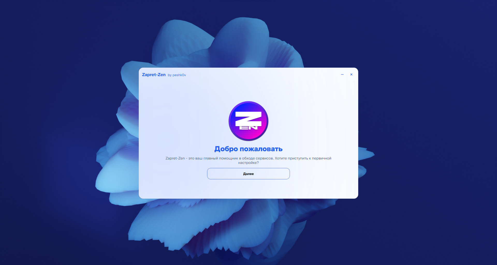

<div align="center">

# Zapret Zen - утилита для быстрого обхода блокировок

<picture>
  <source media="(prefers-color-scheme: dark)" srcset="assets/Hello.png">
  <source media="(prefers-color-scheme: light)" srcset="assets/Hello.png">
  
</picture>

</div>

## Запуск
```
python -m venv venv
venv\Scripts\Activate.ps1
pip install -e .[dev]
python -m zapret_zen.main
```

## Сборка
```
venv\Scripts\python.exe -m PyInstaller -y packaging\zapret_zen.spec
```

## To - Do
- [x] - Полностью выпилить VPN
- [ ] - Переписать интерфейс на библиотеку eel
